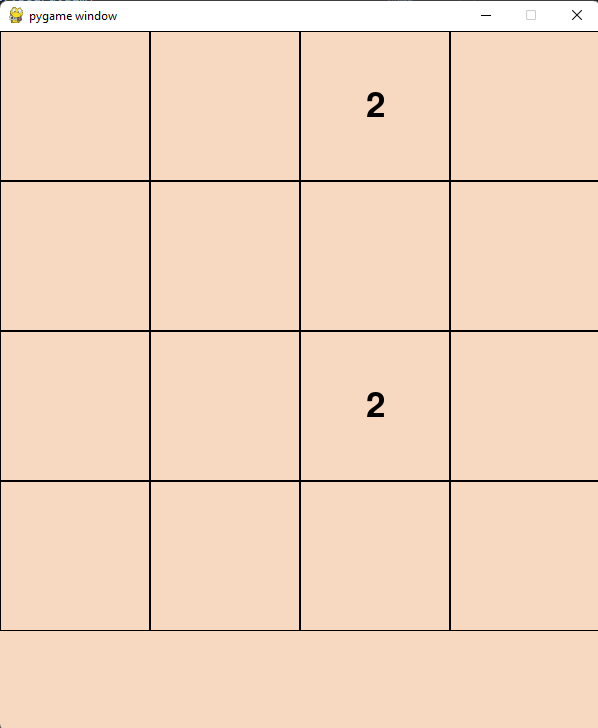
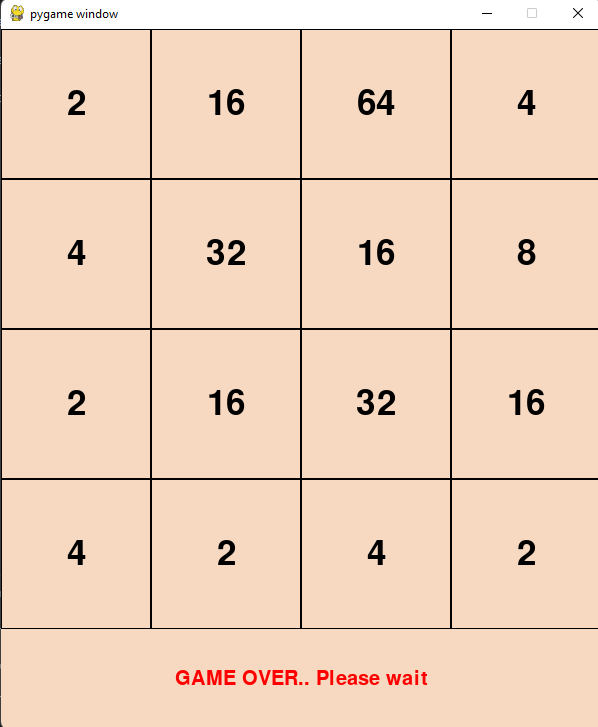

# THE 2048 GAME

2048 is played on a gray 4×4 grid, with numbered tiles that slide when a player moves them
using the four arrow keys. Every turn, a new tile will randomly appear in an empty spot on the
board with a value of either 2 or 4. Tiles slide as far as possible in the chosen direction until they
are stopped by either another tile or the edge of the grid. If two tiles of the same number collide
while moving, they will merge into a tile with the total value of the two tiles that collided. The
resulting tile cannot merge with another tile again in the same move. If a move causes three
consecutive tiles of the same value to slide together, only the two tiles farthest along the
direction of motion will combine. If all four spaces in a row or column are filled with tiles of the
same value, a move parallel to that row/column will combine the first two and last two.

## Images of the Code 

Initial Image:

Final Image: 

